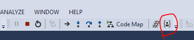

# Just My Code Toggle extension for Visual Studio 2015+

This extension adds the **Debug.JustMyCodeToggle** command to Visual Studio. By default, the command appears in the **Debug** toolbar as well as in the context menu for the **Call Stack** window.

### Debug Toolbar

### Call Stack Window

### Keyboard

By default, the new command is not bound to a keystroke. A key binding may be added manually by configuring a binding for the **Debug.JustMyCodeToggle** command.
