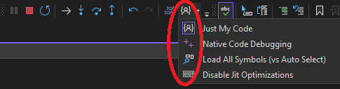
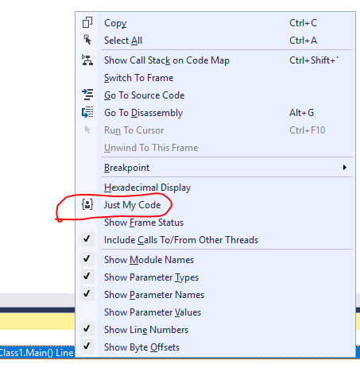

# Just My Code Toggle extension for Visual Studio 2015->2026+

This primary goal of this extension is to add the **Debug.JustMyCodeToggle** from the options menu to the Visual Studio main window. By default, the command appears in the **Debug** toolbar as well as in the context menu for the **Call Stack** window.  It also adds a few other setting commands in the toolbar using a split-button to toggle: Native Code Debugging, All Symbols / Selective Symbol loading, Disable .NET and JIT code optimization for external code or release builds for better preservation of variables/stack items normally optimized away.

JustMyCode toggle can be changed while debugging but the others will only take effect on the next debug session.

### Debug Toolbar

The toolbar also features a few other toggles including:
- Native Code Debugging - The debug properties debug native code option (stored in the .csproj.user file)
- All Module Symbol Loading - Toggle between VS trying to only load symbols for needed files/modules or loading for all modules ( this is the Options->Debugging->Symbols  "Automatic searching symbols" dropdown )
- Disabling native / managed code optimization - Better debugging for native/3rd party code to preserve stack and variables (Only for new CPS style projects with launch profile support, as we need to set env vars).  Env vars are stored in the launch profile but are deleted when you toggle this back off. This is similar to / slightly more robust than the Debugging-> use of precompiled images (which I couldn't find).

### Call Stack Window

### Keyboard

By default, the new command is not bound to a keystroke. A key binding may be added manually by configuring a binding for any of the following commands:
- Debug.JustMyCodeToggle
- Debug.JMCSymbolLocalToggle
- Debug.JMCNativeCodeDebugging
- Debug.JMCDisableJitOptmizations

### VS 2026 Issues / Changes
VS 2026 once again has changed things so the 2022 tricks don't all work.  The plus side is there is a new "Unified" settings manager but it is only available to Extensibility extensions.  We now implement both but it still has issues on its own. Most things work except: controlling load all modules will not work until a project is loaded.  It will toggle but the toggle won't do anything.  There is a big plus to unified settings as we can now 'watch' settings for if they change, this is particularly important for just my code and symbol loading as changing the setting in one VS instance instantly changes it in all instances that are open.

### Implementation
#### Commands
To simplify commands they are broken into two parts, command "setters" that handle getting/setting values using a certain manager (backend) and a base command helper.  Due to the fact we partially support new Extensibility extension sdk there is a bit of oddity to be able to not duplicate code between the old OurOLEButton and our new OurExtensibilityToggleButton.

#### Managers
Managers are the different ways these things can be controlled in VS.  We have:
- DebuggerServiceManager - Uses Debugger5 primarily was the attempt to do `debugger.SetSymbolSettings` to handle setting the module loading but it doesn't seem to actually work (no error just no change).
- DteManager - This uses dte.Properties to set options.  This is kind of like a UI interaction interface. Note there is no documentation of the actual property categories/pages that exist but the manager has `DumpAllSettings` that contains as many as I have found.
- ExtensibilitySettingManager - The new unified settings backend.  This is pretty sleek new system unfortunately getting the Extensibility service is broken right now.  It does work if called from the extension menu.  It has the ability to auto watch for external changes too.
- LaunchProfileManager - For modifying launch profiles of projects directly
- ProjectEventHandler - Generates reference events for us for things like project/solution changes so we can update current state
- SettingsStoreManager - For the VS Settings store (roaming,user,etc).  While some settings appear here often changing things may not change the actual setting in VS (esp in 2026).
- StartupProjectManager - Checks if the startup project has changed and allows accessing the startup projet

#### Entry Points
As the script is a hybrid old style and new extensibility extension it has two entry points:
- ExtensibilityExtensionEntrypoint - Extensibility entrypoint we cant call any extensibility code until here. Unfortunately this is only called once an extensibility command is clicked as it is lazy inited.
- JustMyCodeTogglePackage - The traditional entry point for VSSDK plugins, called shortly after load.